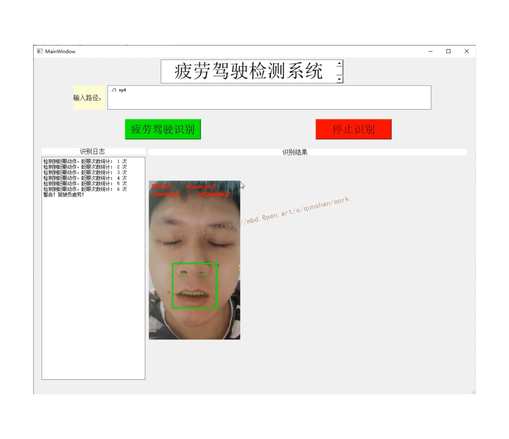
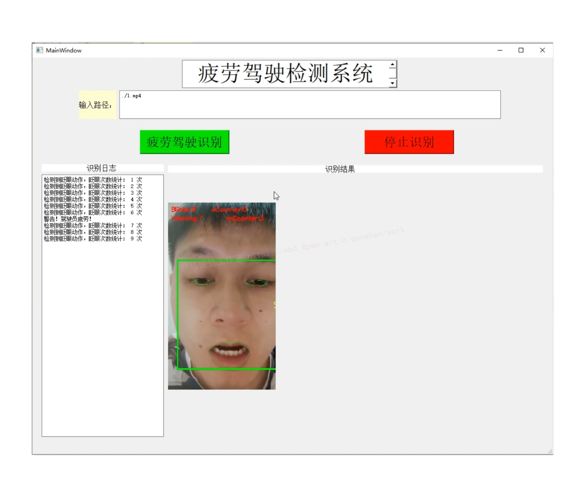
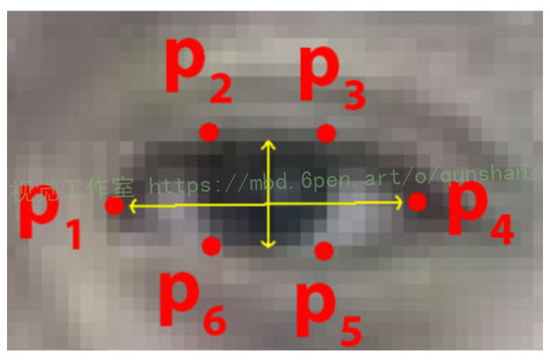
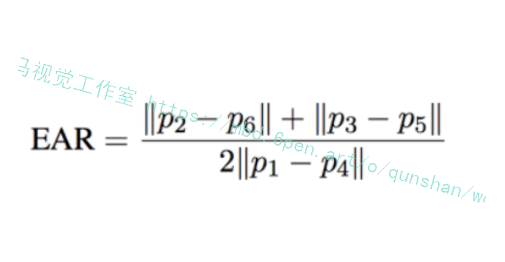
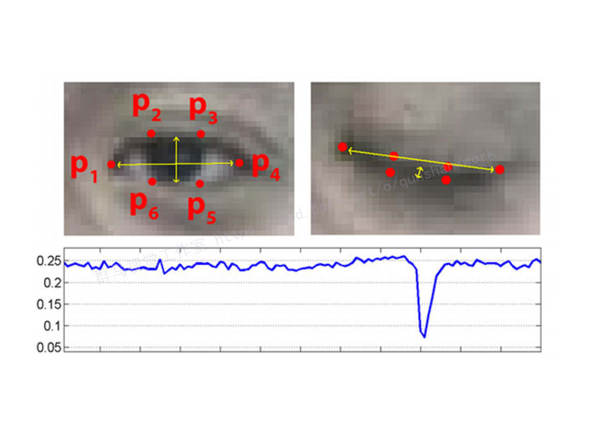
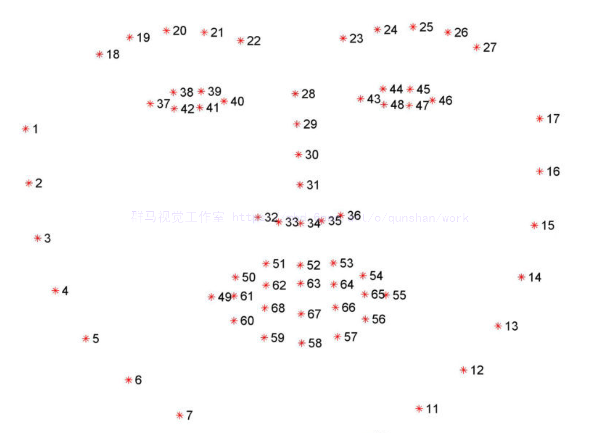


# 1.图片演示




# 2.视频演示
[[项目分享]Python基于OpenCV的实时疲劳检测[源码＆演示视频＆部署教程]_哔哩哔哩_bilibili](https://www.bilibili.com/video/BV1xP411V7Zg/?vd_source=bc9aec86d164b67a7004b996143742dc)

# 3.检测方法
1）方法
与用于计算眨眼的传统图像处理方法不同，该方法通常涉及以下几种组合：

1、眼睛定位。
2、阈值找到眼睛的白色。
3、确定眼睛的“白色”区域是否消失了一段时间（表示眨眼）。
相反，眼睛长宽比是一种更为优雅的解决方案，它涉及基于眼睛面部轮廓之间的距离之比的非常简单的计算。

[参考该博客](https://afdian.net/item?plan_id=71141eac5e6c11ed9bd852540025c377)，这种眨眼检测方法快速，高效且易于实现。

（2）眼睛纵横比
我们可以应用脸部界标检测来定位脸部重要区域，包括眼睛，眉毛，鼻子，耳朵和嘴巴
这也意味着我们可以通过了解特定面部部分的索引来提取特定面部结构：
在眨眼检测方面，我们只对两套面部结构感兴趣：眼睛。
每只眼睛都由6 （x，y）坐标表示，从坐标的左角开始（就像您在看那个人一样），然后沿该区域的其余部分顺时针旋转：


基于此图像，我们应该取消关键点：
这些坐标的宽度和高度之间存在关系。
根据Soukupová和Čech在2016年的论文《使用面部地标进行实时眼睛眨眼检测》的工作，我们可以得出一个反映这种关系的方程，称为眼睛纵横比（EAR）：

```
def eye_aspect_ratio(eye):
    # 计算距离，竖直的
    A = dist.euclidean(eye[1], eye[5])
    B = dist.euclidean(eye[2], eye[4])
    # 计算距离，水平的
    C = dist.euclidean(eye[0], eye[3])
    # ear值
    ear = (A + B) / (2.0 * C)
    return ear

```
其中p1，…，p6是2D面部界标位置。

该方程的分子计算垂直眼界标之间的距离，而分母计算水平眼界标之间的距离，对分母进行适当加权，因为只有一组水平点，但有两组垂直点。

（3）眨眼检测标准
睁开眼睛时眼睛的纵横比大约是恒定的，但是当眨眼时眼睛的纵横比会迅速降至零。
使用这个简单的方程式，我们可以避免使用图像处理技术，而只需依靠眼睛界标距离的比率来确定一个人是否在眨眼。
为了更清楚地说明这一点，[参考该博客](https://mbd.pub/o/bread/Y5WTkplx)：

图： 左上：当眼睛睁开时，眼睛界标的可视化。右上：闭上眼睛时的眼睛地标。底部：绘制随时间变化的眼睛纵横比。眼睛纵横比的下降表示眨眼
```
def shape_to_np(shape, dtype="int"):
    # 创建68*2
    coords = np.zeros((shape.num_parts, 2), dtype=dtype)
    # 遍历每一个关键点
    # 得到坐标
    for i in range(0, shape.num_parts):
        coords[i] = (shape.part(i).x, shape.part(i).y)
    return coords

```
在左上角，我们的眼睛完全张开-此处的眼睛长宽比会很大（r），并且随着时间的推移会相对保持恒定。
但是，一旦眨眼（右上角），眼睛的宽高比就会急剧下降，接近零。
在底部图中绘出了眼纵横比随时间的视频剪辑的曲线图。如我们所见，眼睛的纵横比是恒定的，然后迅速下降到接近零，然后再次增加，表明已经发生了一次眨眼。
在确定视频流中是否发生眨眼时，我们需要计算眼睛的宽高比。
```
# 设置判断参数
EYE_AR_THRESH = 0.3  # ear小于0.3判断为闭眼
EYE_AR_CONSEC_FRAMES = 3  # 连续三帧ear都小于0.3判断为眨眼

# 初始化计数器
COUNTER = 0
TOTAL = 0
```
如果眼睛的宽高比下降到某个阈值以下，然后又上升到该阈值以上，那么我们将注册“眨眼”- EYE_AR_THRESH 是此阈值。我们将其默认设置为0. 3 因为这对我的应用程序最有效，但是您可能需要针对自己的应用程序进行调整。
```
# 遍历每一帧
while True:
    # 预处理
    frame = vs.read()[1]
    if frame is None:
        break

    (h, w) = frame.shape[:2]
    width=1200
    r = width / float(w)
    dim = (width, int(h * r))
    frame = cv2.resize(frame, dim, interpolation=cv2.INTER_AREA)
    gray = cv2.cvtColor(frame, cv2.COLOR_BGR2GRAY)

    # 检测人脸
    rects = detector(gray, 0)

    # 遍历每一个检测到的人脸
    for rect in rects:
        # 获取坐标
        shape = predictor(gray, rect)
        shape = shape_to_np(shape)

        # 分别计算ear值
        leftEye = shape[lStart:lEnd]
        rightEye = shape[rStart:rEnd]
        leftEAR = eye_aspect_ratio(leftEye)
        rightEAR = eye_aspect_ratio(rightEye)

        # 算一个平均的
        ear = (leftEAR + rightEAR) / 2.0

        # 绘制眼睛区域
        leftEyeHull = cv2.convexHull(leftEye)
        rightEyeHull = cv2.convexHull(rightEye)
        cv2.drawContours(frame, [leftEyeHull], -1, (0, 255, 0), 1)
        cv2.drawContours(frame, [rightEyeHull], -1, (0, 255, 0), 1)

        # 检查是否满足阈值
        if ear < EYE_AR_THRESH:
            COUNTER += 1

        else:
            # 如果连续几帧都是闭眼的，总数算一次
            if COUNTER >= EYE_AR_CONSEC_FRAMES:
                TOTAL += 1

            # 重置
            COUNTER = 0

        # 显示
        cv2.putText(frame, "Blinks: {}".format(TOTAL), (10, 30),
            cv2.FONT_HERSHEY_SIMPLEX, 0.7, (0, 0, 255), 2)
        cv2.putText(frame, "EAR: {:.2f}".format(ear), (300, 30),
            cv2.FONT_HERSHEY_SIMPLEX, 0.7, (0, 0, 255), 2)

    cv2.imshow("Frame", frame)
    key = cv2.waitKey(10) & 0xFF

    if key == 27:
        break

vs.release()
cv2.destroyAllWindows()
```
然后我们有一个重要的常数， EYE_AR_CONSEC_FRAME —此值设置为 3 表示连续三个帧的眼睛长宽比小于EYE_AR_THRESH 必须进行眨眼才能注册眨眼。
同样，根据流水线的帧处理吞吐率，您可能需要为自己的实现提高或降低此数字。
第44和45行初始化两个计数器。柜台 是眼睛长宽比小于的连续帧的总数 EYE_AR_THRESH 尽管 全部的 是脚本运行期间发生的总闪烁次数。


完整[源码&环境部署视频教程&自定义UI界面](https://s.xiaocichang.com/s/8ce3b3)
参考博客[《Python基于OpenCV的实时疲劳检测\[源码＆演示视频＆部署教程\]》](https://mbd.pub/o/qunma/work)


# 4.参考文献
***
[1] 汪明明,林小竹.基于OpenCV人眼定位的人脸检测方法[D].北京石油化工学院.2012（12）.

[2] 傅亚煌,黄鸣宇.基于眼动特性的机动车驾驶疲劳系统[J].电脑与信息技术.2013(2).

[3] 王奕直,周凌霄,孔万增.基于Adaboost的疲劳驾驶眨眼检测[D].杭州[<u>电子</u>](http://www.youerw.com/tongxin/)科技大学学报.2013(8).

[4] 张旭,李亚利,陈晨,王生进,丁晓青.嵌入式驾驶员状态检测算法的实现与优化[J].自动[<u>化学</u>](http://www.youerw.com/huaxue/)报.2012(12).

[5] 赵钟.驾驶员疲劳检测方法研究及嵌入式实现[D]. 大连海事大学.2010(6).

[6] 徐淑峰,孙炜,赵峰,张忠.Adaboost人脸检测算法在嵌入式平台上的优化与实现[D].上海交通大学微电子学院.2008(6).

[7] 牛慧萍.基于DSP的人眼状态信息检测系统的研究和设计.[D].沈阳理工大学.2010(3).

[8] 郑玉铎.田杨萌.靳薇.基于Adaboost 和ASM 算法的人眼定位.[J] .北京信息科技大学学报.2013(6).

[9] 郭纯宏.基于嵌入式的人眼信息检测系统研究.[D].沈阳理工大学.2011(3).

[10] 王洪涛.驾驶疲劳测评方法研究及其DSP实现.[D].武汉理工大学.2007(5).

[11] 向本科.基于人眼检测的驾驶员疲劳检测研究.[D].西南大学.2010(5).

[12] 常瑜亮.基于DSP的疲劳驾驶检测系统硬件设计与实现. [D].沈阳理工大学.2010(3).

[13] 李文磊.基于DSP的疲劳驾驶实时监测系统研究.[D] .南京理工大学.2007(6).


---
#### 如果您需要更详细的【源码和环境部署教程】，除了通过【系统整合】小节的链接获取之外，还可以通过邮箱以下途径获取:
#### 1.请先在GitHub上为该项目点赞（Star），编辑一封邮件，附上点赞的截图、项目的中文描述概述（About）以及您的用途需求，发送到我们的邮箱
#### sharecode@yeah.net
#### 2.我们收到邮件后会定期根据邮件的接收顺序将【完整源码和环境部署教程】发送到您的邮箱。
#### 【免责声明】本文来源于用户投稿，如果侵犯任何第三方的合法权益，可通过邮箱联系删除。